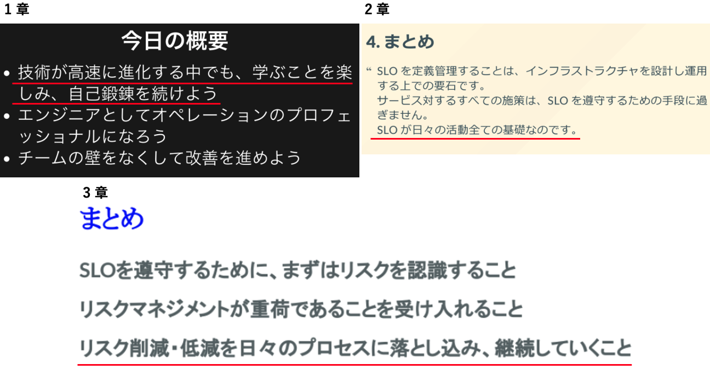
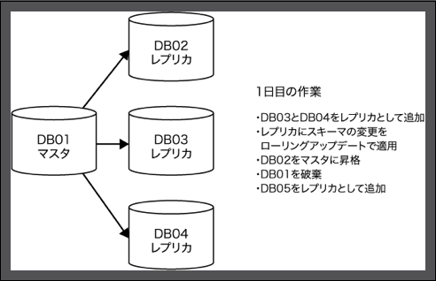
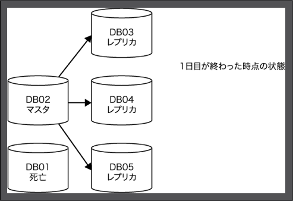
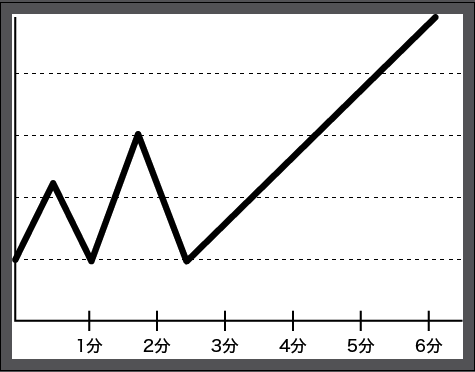
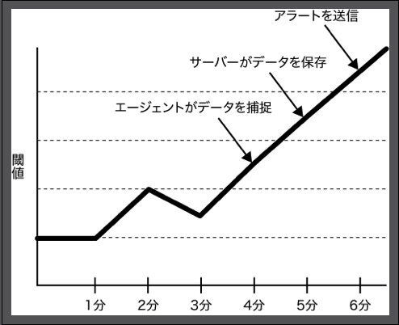

# DBRE 輪読会 Chap.4

〜オペレーションの見える化〜
2021/07/15

---

**本スライドは 51 ページあります**
~~時間がなくて全然まとまらなかったので~~ **後から振り返るときのために残しておきたかったので、あえて発表用に削っていません**
**独断と偏見で重要なページに★付けたので、★を中心に読んでいきます**

---

## 前回までのあらすじ

---

## 今回学ぶこと

- 見える化の目的
- 監視のサバイバルキット
- サバイバルキット成長の心構え
- レイヤーごとの可視化ポイント

---

## 今日の概要

- 見える化の標準仕様
- 可視化のためのデータの入力・出力
- 監視の第一歩
- 計器（アプリ、ホスト、データベース）
- 見える化（DB接続レイヤ、DBの内部構造、DBクエリ、DBのアサートとイベント）

---

### 見える化が重要な理由 ★

- アラートの発生と収束
- パフォーマンス測定
- キャパシティプランニング
- デバッグとポストモーテム
- ビジネス分析
- 原因と結果の相関分析

---

## 4.1 現在の見える化の標準仕様 ★

1. 見える化をBIのように扱う
2. 仮想環境におけるクラスタの見える化
3. 高分解能でのメトリクス収集
4. アーキテクチャをシンプルに保つ

---

### 4.1.1 見える化をBIのように扱う

なぜ見える化を進めるのか？
- 「この事象はSLOに対してどういった影響があるか？」
- 「障害はどのように、そして、なぜ発生したのか？
  - OpVizのツールをOpsチームだけの所有物とするのではなく、BIとして活用の幅を広げていかなければならない

***「究極の見える化とは、ビジネスがどのように動作し、アプリとインフラにより、ビジネスはどのような影響を受けるのかを誰もが理解できるものです。」***

---

### 4.1.2 仮想環境におけるクラスタの見える化

動的に変化するインフラでは、メトリクスはホスト名やIPアドレスではなく、ロールごとに保存されることが必要

 → 

---

### 4.1.3 高分解能でのメトリクス収集 (1)

- CPUなど高分解能での計測がSLOに直結する指標は1秒以下のメトリクス収集間隔を保つ
- ディスクの空き容量やサービスのヘルスチェックなどは1分以上でもOK
- **現在収集しているメトリクスが妥当な分解能であるかどうかは、1秒から10秒の間に変化が発生したときに、それがSLOに影響を与えうるかどうかで判断**
  - ただしシンプルさを保つため、計測間隔は5種類以下にとどめる

---

### 4.1.3 高分解能でのメトリクス収集 (2)

- 計測間隔が長すぎると負荷を正しく予測・検知できないリスクあり
  - ex) 計測間隔を1分と長くするとスパイクが1度も現れなくなる

 → 

---

### 4.1.4 アーキテクチャをシンプルに保つ

”大事なことは前述した通り、ノイズをゼロに抑えることです。
多くのメトリクスを見ておきたい気持ちを抑えて、アラートや人間の手が必要なレベルになる必要最小限のものに絞りましょう。
すべてを監視するというのは、監視システムがまだ未成熟でおざなりだった時代のコンセンサスであり、今では現実的ではありません。
大企業であっても、本当に重要なのはどのメトリクスなのかを見極め、取捨選択する文化を育てていくべきです。”

---

#### メトリクスのどこを見ればいいのか？

まずはSLOに直結するメトリクスから優先して見る（2章参照）

- レイテンシ
- 可用性
- コールレート
- 利用率

---

## 4.2 OpVizフレームワーク

- OpVizを大きな分散I/Oデバイスと捉える
  - データはエージェントやクライアントによって収集 → 中央サーバーに格納
    - プル型とプッシュ型がある
  - クライアントがメトリクスを収集 or イベントルータに転送
  - イベントルータはデータを所定の場所に送信
  - データは長期間保存

---

## 4.3 データの入力

“アウトプットのためには、よいインプットが必要です。自前の環境から採掘したデータが利用可能であるときは、いつでもそれを使いましょう”

- ブラックボックスモニタリング
  - 監視対象の期間やアイテムがそれほど多くない場合に有効
- ホワイトボックスモニタリング
  - 十分な量のデータを収集することができる場合に有効

---

### 4.3.1 テレメトリ／メトリクス

- カウンタ
  - 累積する値であり、事象の発生回数を示すもの。
- ゲージ
  - 温度、キュー中のジョブ数、アクティブロック数など増減の振れ幅があるもので、現在の値を示すもの。
- ヒストグラム
  - データ集合のうちイベントの発生回数を示すもの。
- サマリ
  - ヒストグラム特定の時間枠単位でのカウントに特化したもの
- （参考：[Prometheus のカウンタ、ゲージ、サマリ、ヒストグラムについて](https://zenn.dev/empenguin/articles/0673e581efd20b)）

---

### 4.3.1 テレメトリ／メトリクス

- 重要な関数
  - Count
  - Sum
  - Average
  - Median
  - Percentiles
  - Standard Deviation
  - Rates of Change
  - Distributions

---

### 4.3.2 イベント

- その環境で発生したアクションのこと
- ex)
  - 設定ファイルの変更
  - コードのデプロイ
  - データベースのフェイルオーバー

---

### 4.3.3 ログ

- イベントごとに生成される記録のこと
  - ログ生成もイベントの１つ
- メトリクスとは異なり、ログはすでに発生したイベントに追加する形でデータやコンテキストを記録する

---

## 4.4 データの出力 (1) ★

- アラート
  - SLOに準拠できない事象が起ころうとしているときのみ発砲する
- チケット／タスク
  - 必ず完了させなければならない重要な作業について作成する
- 通知
  - システムに発生するイベントを記録・共有する
  - 通知の媒体・頻度は作業を妨げない程度に調整する

---

## 4.4 データの出力 (2) ★

- 自動化
  - 監視の結果をトリガーとして、何らかのタスクを自動化する
  - ex) 利用率のデータに応じてオートスケールを割り当てるようにする
- 見える化
  - 部門ごとにダッシュボードを作成するなどして各部門が知りたいことを即座に理解できるようにする

---

## 4.5 監視の第一歩 ★

”これらは構築し、改善していくプロセスの一部です。
最初は小さく始めて、徐々に進化させていきましょう。
スタートアップの組織であればなおさらです。

自分たちの本尊となるプロダクト開発を疎かにして見える化のエコシステムから構築するようなスタートアップは、愚か以外の何ものでもありません。
パフォーマンスの見える化などは、サービスがヒットして必要になってから取りかかりましょう。
まずは、必要最低限の**サバイバル監視セット**から始めましょう。”

---

#### サバイバル監視セット ★

1. データは安全か
2. サービスは落ちていないか
3. 顧客のサービス体験に痛みが伴っていないか

---

### 4.5.1. データは安全か ★

- ミッションクリティカルなデータは少なくとも合計3つのレプリケーションを持つ必要がある
  - 1台に障害が発生した場合でもまだ冗長性が保たれていることを保証するため
- 失われてもいい・再生可能なデータはn+1個のレプリケーションを持っていれば十分
  - （n: ノードの個数）

---

#### データの安全性の監視サンプル

- 3つ以上のノードが稼働していること
- レプリケーションのスレッドが稼働していること
- レプリケーションは少なくとも1つのノードでレプリケーション遅延が1秒以下であること
- 直近のバックアップが成功していること
- 直近のバックアップからスレーブが自動的に構築できること

---

### 4.5.2 サービスは落ちていないか ★

- サービスが利用可能な状態かどうかをチェックするため、外部からのエンドツーエンドのチェックを行う
  - 顧客のサービス体験を反映するものであるため
  - すべてのレイヤを一気通貫でチェックできるようなヘルスチェックであるべき
- ロードバランサからのヘルスチェックはシンプルなものに保つ
  - 組み合わせによってヘルスチェック地獄に陥るため
- クラウド等の死活監視のため、オフプレミスな外部監視も用意する
  - 難しい場合、監視サーバーの監視自体だけでも外部チェックする

---

#### データベース可用性の監視サンプル

- アプリケーションレイヤでヘルスチェックが有効であること
- クエリが各パーティションやクラスタの各ノードを参照するようなものであること
- キャパシティ不足の兆候を把握できること
  - ディスクのキャパシティ
  - データベースのコネクションのキャパシティ
- エラーログのスクレイピングを実施することで、以下を感知可能であること
  - データベースの再起動の感知
  - データベースの破損の感知

---

### 4.5.3 顧客のサービス体験に痛みが伴っていないか ★

システムが落ちていなくても、レイテンシが倍もしくは3倍になったら、もしくはリクエストの10%がエラーを返すようになったらどうでしょうか？
- ヘルスチェックをすり抜ける可能性がある兆候の例
  - データベースが、書き込みはできないが読み取りはできる状態
  - レプリケーション遅延が発生していた場合
  - ディスクのRAIDに異常が発生したためにデグレモードになり、インデックスのビルドが始まった場合
  - RAIDを構成している一部のHDDに異常が検知されたためRAIDの再構築が実施された場合
”システムが障害を起こす原因は無数に存在し、事前にその障害を予想できるのは、そのうちの5%といったところでしょうか。”

---

#### サバイバルキットを成長させていくために ★

”サービスの状態については、収集しているメトリクスから何が起こっているのか、この兆候が示しているのはどういった事象と関係があるのか、このままいくと何が起こるのか、そうした高次元の判断ができるように一歩一歩、自分自身のメトリクスを読み取る能力を成長させていきましょう。
障害の原因を特定できたら、次は何でしょうか？ そのコンポーネントが壊れる瞬間を見届けましょう。
多くの構築例の経験を積むとともに、多くの障害例の経験を積むこともまた重要なのです。
今まさに壊れていくその瞬間、メトリクスはどういった値を表示するのか、ログに何が記載されるのか、注意深く最後を見届け、将来の糧にしていきましょう。”

---

## 4.6 アプリケーションの計器

まずはアプリケーションとユーザーの動きを把握（ツールも有用）
- APIエンドポイントにおけるすべてのリクエストとレスポンスは、すべてロギングおよび測定する。
- アプリケーションが利用している外部リソース、つまりデータベース、インデックス、そしてキャッシュも測定する。
- アプリケーションのジョブおよびワークフローも同様に監視する。
- データベースやキャッシュに対して相互に作用するメソッドや関数も同様に監視する。
- 各エンドポイント、ページ、そしてメソッドや関数ごとにどれくらいのデータベースに対してクエリを発行しているかを監視する。

---

### 4.6.1 分散トレーシング (1)

“データベースのアクセスをすべて可視化することには価値があります。可視化により、エンジニアのチームはどういったクエリを書くと問題になるかを実践と関係づけることで、自発的によいクエリの書き方を学んでいけるからです。DBREであるあなたが逐一注意しなくても、そこに有用な情報が整備されていれば、エンジニアは自分自身で学習していくものです。”

“DBREにとって、アプリケーションレイヤからデータベースレイヤまでエンドツーエンドで何が発生しているかを把握するためには、多くのコンポーネントに興味を持たなければなりません。すべてではないものの、以下がその一端となるものです。”

---

### 4.6.1 分散トレーシング (2)

- データベースのマスタもしくはスレーブに対しての接続を確立する（Establish）
- コネクションプールにおいて、コネクションの接続待ちのキュー
- キューやメッセージングのロギング
- UUIDを利用したユーザーIDの作成と管理
- クラスタにおけるユーザーIDなどをベースにしたシャーディング
- データキャッシュにおける検索、キャッシュ、そして有効期限の設定
- アプリケーションレイヤにおけるデータの圧縮と暗号化
- クエリの実行

---

### 4.6.2 イベントとログ

“いうまでもないことですが、すべてのアプリケーションのログを収集しましょう。これにはスタックトレースも含まれます。また、OpVizにとって有用となる以下のイベントも、そのログを登録し、見える化しておくべきでしょう。"
- デプロイの実施
- デプロイの時間
- デプロイのエラー

---

## 4.7 サーバーやインスタンスの計器

DBのホストサーバーの状態を把握する
- CPU
- メモリ
- ネットワークインターフェイス
- ストレージ I/O
- ストレージキャパシティ
- ストレージコントローラ
- ネットワークコントローラ
- CPU インターコネクト
- メモリインターコネクト
- ストレージインターコネクト

---

### 4.7.1 イベントとログ

- サービスに組み込まれた、または外されたホスト
- 設定管理ツールやプロビジョニングツールのログ
- ホストの再起動ログ
- サービスの再起動ログ
- ホストの障害ログ
- サービスの障害ログ
”OpVizプラットフォームを構築するにあたって、ホストとOSのレイヤを深く理解しておけば、より洗練されたものを構築できるでしょう。”

---

## 4.8 データベースの計器 ★

データベースでまず監視・トレースすべきもの
1. データベースの接続レイヤ
2. データベース内部の見える化
3. データベース内のオブジェクト
4. データベースに投げられるクエリ

---

## 4.9 データベースの接続レイヤ

全体のトランザクションの中で、バックエンドのデータベースへの接続にかかる時間の割合を調べる

1. 利用率
2. リソースの飽和点
3. エラー

---

### 4.9.1 利用率

- 接続数の上限と接続数のカウント
- 接続状態（接続中、スリープ中、中断、その他）
- カーネルレベルでのファイル利用率
- カーネルレベルでのプロセス利用率
- メモリ利用率
- MySQLにおけるスレッドプールのメトリクスや、MongoDBにおけるスレッドプールの利用率
- ネットワークスループットの利用率
  - 同時最大接続数の理論値100%に近い数字を記録 → Good
  - 最大接続数に及ばず頭打ちの状態になっている → 何らかの原因

---

### 4.9.2 リソースの飽和点

- リソースの使用を待ち続けているのに利用率が最大まで達していない → 阻害要因がある
- チェックポイント
  - TCP接続ログ
  - データベース特有の接続キュー（たとえばMySQLのバックログ）
  - 接続タイムアウトエラー数
  - コネクションプールにおいて割り当て待ちのスレッド数
  - メモリのスワッピング状態
  - ロック状態のデータベースプロセス数

---

### 4.9.3　エラー

- 障害の原因や設定による制限をエラーから特定することも重要
- チェックポイント
  - データベースのエラーログ
    - デバッグ時にはログレベルを上げることも必要
    - ストレージのI/Oを消費する点に注意
  - アプリケーションやプロキシのログ
  - ホスト自体のリソース利用率

---

## 4.10 データベースの内部構造の見える化 ★

利用率、リソースの飽和点、エラーを見える化するために、
データベースの内部構造を見える化する
1. スループットとレイテンシのメトリクス
2. コミット、再実行、ジャーナリング
3. レプリケーション状態
4. メモリ構造
5. ロックと並行性

---

### 4.10.1 スループットとレイテンシのメトリクスの見える化

- イベントによって負荷がどのように推移するか全体的に捉えられることが重要
- 負荷の指標となるメトリクスの例
  - 読み込み処理
  - 書き込み処理
    - 挿入、更新、削除
  - その他の処理
    - コミット、ロールバック、DDLの実行、他の管理ジョブの実行

---

### 4.10.2 コミット、再実行、ジャーナリングの見える化

- メモリ上のデータをフラッシュしてディスクに書き込む処理を把握
- チェックポイント
  - ダーティバッファ（MySQL）
  - チェックポイントの経過時間（MySQL）
  - コンパクションタスクの中断および完了（Cassandra）
  - ダーティバイト（MongoDB）
  - 修正された、もしくは未修正の退避（evicted）ページ（MongoDB）
  - log_checkpoints の設定（PostgreSQL）
  - pg_stat_bgwrite ビュー（PostgreSQL）

---

### 4.10.3 レプリケーション状態の見える化

- 可用性、ディザスタリカバリ、安全性の担保のため、レプリケーション状態の把握は重要
- チェックポイント
  - レプリケーションのレイテンシ（同期のスピード）
  - レプリケーションが失敗していないか
  - レプリケーションドリフト
    - データがイミュータブル ＆ 処理の多くがinsertまたはreadの場合、対象となるデータ範囲のチェックサムをマスタ／スレーブ間で比較すれば同一かどうか判断可能

---

### 4.10.4 メモリ構造の見える化

- データキャッシュを把握（パース済みのキャッシュ、SQL、接続、クエリ結果）
- チェックポイント
  - 利用率
  - 撹拌率
  - ヒット率
  - 同時並行制

---

### 4.10.5 ロックと並行性の見える化

”ロックを監視すること、またロック取得にかかった時間を監視することが、見える化の第一歩です。ロックがレイテンシにどのように影響を与えているか、ロックを長く保持して、なかなか離さないプロセスは何か、どこでリソースの飽和に達しているのかを見える化しましょう”
“ロールバックとデッドロックの発生を監視することも重要です。あるセッションがロックを正常に解放できないと、ほかのセッションのロック待ちとデッドロックの発生の原因になります。そして、最終的にはデッドロック発生によりロールバックが発生します。ロールバックの発生自体はそれほど異常なことではありませんが、頻繁にロールバックが発生する環境では、その原因を突き止めなければなりません。”

---

## 4.11 データベース内オブジェクトの見える化

- データがDBにどのように格納されているか理解しておくことが重要
- 最低限、1つのオブジェクトとそのリレーションになるキーやインデックスそれぞれにつき、どれだけのストレージを消費するのか把握しておくべき
- データの分布を把握することも重要
  - アプリ開発者に共有することで開発最適化に役立つ（データタイプ、インデックス効率等）

---

## 4.12 データベースクエリの見える化

”ただでさえ、リソースが逼迫しているサーバーで、クエリのロギングに高い優先順位を与えることは、消火ホースを使って水を飲むようなもので、システムに深刻なレイテンシおよび冗長化の低下をもたらすでしょう。
ただ、依然としてデータは最優先ですし、クエリのロギングは重要です。”
- CortexやCirconusといったツールを使用してTCPレベルでロギング
- 比較的負荷が少ないロギング専用のレプリカを用意して限定した時間だけロギング
- スロークエリに限りロギング

---

## 4.13 データベースのアサートとイベントの見える化

- 他の情報と組み合わせてイベントの相関関係が分かる
- チェックポイント
  - 接続試行回数とエラー回数
  - データが破損していることを示すワーニングとエラー
  - データベースの再起動
  - 設定の変更
  - デッドロック
  - コアダンプとスタックトレース

---

## 4.14 まとめ ★

- OpVizシステムは常に改善していくもの
- いったん見える化を実現し、システムにとってどれくらい役立つものか実感しよう
- 他のインフラ部分と同様に見える化には相応のコストをかけるべき

---

## 4章のおさらい（発地まとめ） ★

- OpVizの目的は「この事象はSLOに対してどういった影響があるか？」「障害はどのように、そして、なぜ発生したのか？」という質問に答えること
- まずはサバイバル監視セットから始めよう（1. データは安全か、2. サービスは落ちていないか、3. 顧客のサービス体験に痛みが伴っていないか）
- 継続的にアーキテクチャ全体に監視を拡大させていくとともに、多くの構築・障害経験を積んで将来の糧にしよう
