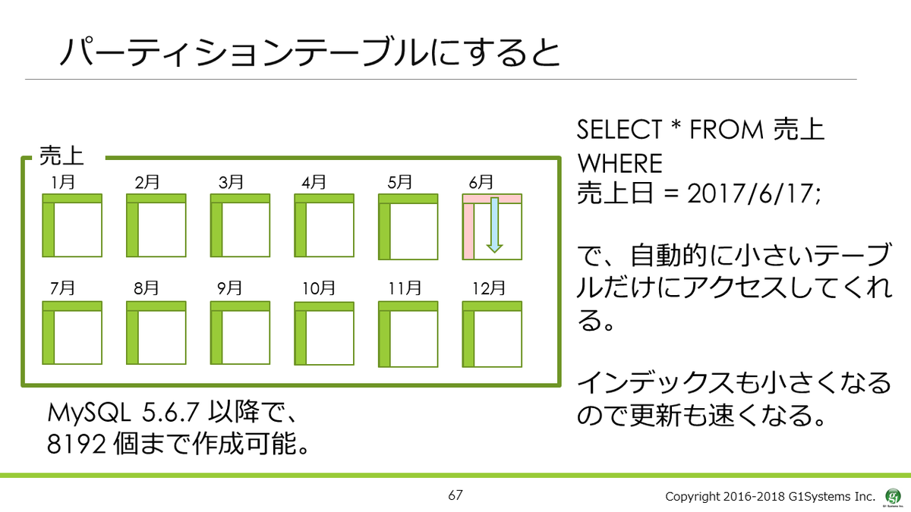
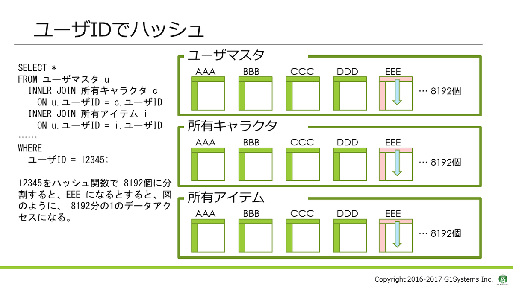

# DBRE 輪読会 Chap.8

〜リリースマネジメント〜
2021/08/18

---
<!--
## 前回までのあらすじ

--- -->

## 今回学ぶこと

本章の目的は、DBREがどのようにして自身の時間とスキルを活用してほかのエンジニアをサポートするか、です。そのためには継続的インテグレーション（CI：continuous integration）と継続的デプロイ（CD：continuous delivery）をワークフローの妨げとすることなく最適化することが重要です。

---

## 今日の概要

1. 教育と協力
2. 継続的インテグレーション
3. テスト
4. デプロイメント

---

## 8.1 教育と協力

- リリースマネジメントの第一歩として取りかからなければならないことは、DBに関する教育
  - エンジニアがDBに関する十分な知識とスキルを持てば質問を受けることが減る
- まずは、日々行っている作業を具体的に書き出し、それらを測定可能に、そして実行可能にしていく
- チームと組織を成功に導くために鍵となる指標は何か、そのためにはどういった戦略と変更を実施していくべきか、教育や協力を通してどのように組織に貢献していく
  - DBREの助けが必要な設定の件数はどれくらいか？
  - データベース依存で、デプロイが成功もしくは失敗する件数はどれくらいか？
  - 機能開発の速度はどれくらいか、ソフトウェアエンジニアがプロダクション環境でDBREにどれくらいの頻度で相談に訪れるか？
  - データベースの変更によるダウンタイムはどれくらいか？

---

### 8.1.1 データベース情報のキュレーターとなる

- DBに関する情報を整理し、要約して組織内に共有する
- 定期的にデータベースに関する情報のニュースを発信する
- やってうまくいったことや継続的に行っている開発を共有する

---

### 8.1.2 データベース議論の触媒となる

情報共有も進めば、データベースに関して、何らかのアイデアや議論が沸き起こるはずです。すかさず参考になる記事や、場合によっては性能実験を行い、データベースへの興味をさらに掻き立てるよう働きかけましょう。

- 週1回の技術ミーティング
- ランチ会
- オンライン上の、何でも質問受け付ける（AMA）イベント
- 技術共有を目的とした専用のチャットチャンネル
- 他のチームとの交流を目的としたオープンオフィス

---

### 8.1.3 ドメイン固有知識（アーキテクチャ）①

現在の開発の裏事情や、歴史的経緯を知ることに努めましょう。特定のデータベースや設定には、そうなっただけの理由があるものです。知り得たドメイン知識は、新規に加入したエンジニアに展開し、それらがそうなった理由、妥協点、歴史的負債、そしてどこで信頼できる情報を見つけられるかといった、メタ知識を展開できるようにしておくのです。

これらはほかのエンジニアが仕事しやすいように共有するだけでなく、新しいアーキテクチャを考える際のヒントも与えてくれるでしょう。どうしたら、過去の失敗の轍を踏まずに、問題をスムーズに、スマートに解決できるでしょうか。

---

### 8.1.3 ドメイン固有知識（アーキテクチャ）②

ドキュメントに含めるべき点

- ドキュメント要旨
- ドキュメントの目的
- ドキュメントの背景
- プログラムやプロセスの設計
- プロジェクトの制限事項
- 現在の実装やツールを採用するに至った理由と代替案
- デプロイ手順の詳細

---

### 8.1.3 ドメイン固有知識（データモデル）

- データがどこをどう経由してDBに到達するかを表す
- エンジニア全員がDBに関する必要な情報をどこから入手すればいいのか周知していれば、調査のために膨大な時間を費やすことがなくなる

---

### 8.1.3 ドメイン固有知識（標準化とベストプラクティス）

定期的に以下のことを共有し、組織内に展開していきましょう

- プロジェクトで標準として使用されているデータ型
- インデックス
- メタデータの属性
- 使用すべきデータストア
- 利用可能なメトリクス
- デザインパターン
- データベースに変更を加える際のベストプラクティス

https://martinfowler.com/articles/evodb.html

---

### 8.1.3 ドメイン固有知識（ツール）

- DBチームにとって、エンジニアチームは、ある意味では顧客
- エンジニアチームが効率よく開発作業を進められるように、常にコミュニケーションを取る
- まずは最小限のツールの導入から、監視、DB関連作業でうまくいっていること、うまくいっていないこと、抱えている問題と要望を共有する
- そこから徐々にツールの幅を広げていけば、開発作業はより効率的になる
-
<!--
- EstyのSchemanator
- Percona Toolikt （オンラインで部分的にスキーマを変更するさいに役立つ）。
- SQLのチューニングと最適化スイート。
- SeveralNines Cluster Configurator（SeveralNines社が提供）。
- データベース変更時に参考となるテンプレートと具体例を、あらかじめレポジトリにコミットしておく。
- データベースのマイグレーション時に参考となるテンプレートと具体例を、あらかじめレポジトリにコミットしておく。
- テスト、可視化、分析機能を備えたベンチマークツール。 -->

---

### 8.1.4 脱セクショナリズム

組織内で一緒に働くチーム同士の関係を良好に保つことは、チームを超えてプロジェクトを進めていくうえでとても重要です。

こうしたチーム間のつながりやコミュニケーションを能動的に促進する役割が、DBREにも求められています。ソフトウェア開発においては、データベースの役割が全体に占める割合が大きく、そこに大きなリファクタリングの余地が残されているケースが多々あります。まさにそのスキマを埋め、開発を効率的にし、成功へと導くのがDBREなのです。

---

## 8.2 継続的インテグレーション ①

- DBを操作するコードやライブラリが更新されるたびにビルドが走るようにする
- DBREだけでなく、エンジニアチームの全員がビルドに対して責任を持たなければなりません。

---

## 8.2 継続的インテグレーション ②

CIをデータベースのレイヤに持ち込むことはとても骨が折れる

- 機能的な面（アプリがDBをO/Rマッパーを介して機能的に扱う）と運用的な面（可用性、整合性、レイテンシ、セキュリティを考慮する）のバランスを考える
- DBオブジェクトに対する変更は既存のコードや別部分のクエリにさえ影響を与える
- 十分に枯れていない機能を使用した場合DBが壊れやすくなる
- 機能面でエッジケースがデータの整合性を損なわないかテストする

---

### 8.2.1 前提条件

CIをDBレイヤで構築するためには以下の要求を満たす必要がある

1. バージョン管理システム
2. データベースの自動ビルド
3. テストデータ
4. マイグレーションとパッケージング
5. CIサーバーとテストフレームワーク

---

#### 8.2.1.1 バージョン管理システム

- 以下をすべてコミットしましょう
  - データベースオブジェクトの変更履歴
  - トリガ設定
  - プロシージャと関数
  - ビュー
  - 設定
  - サンプルデータセット
  - データ削除スクリプト
- これらをバージョン管理システムの配下に置くことで、以下の点が保証されます。
  - データベース構築に必要なすべてが、常に手もとにある状態を維持できる
  - 自動デプロイに必要な自動ビルドが実行可能になる（6章参照）
  - データベースの変更履歴とバージョンを管理することにより、リカバリや分析、問題解決に役立てられる
  - アプリケーションとデータベースのバージョンを同期させておくことにより、動く組み合わせを担保できる

---

#### 8.2.1.2 データベースの自動ビルド

6章「インフラストラクチャマネジメント」で紹介した設定管理とその自動化をすでに実装している場合、データベースの自動化をそこに組み込むことは難しくありません。
そのためには、最新のデータ定義言語（DDL）を使用し、テスト用のデータセットを用意するのもよい選択です。
ただ、プロダクション環境で使用しているデータからテスト用のデータセットを用意するのは、なかなか大変です。
コンプライアンスを遵守するためには、顧客関連データの消去や修正を行う必要があるからです。

---

#### 8.2.1.3 テストデータ

空のデータベースのパフォーマンスは非常に高く、小規模のデータベースもほぼ同様です。このため、役割ごとに異なる3種類のデータセットを用意するのがよいでしょう。1つはアプリケーションがテーブルを操作するために必要な、最低限のメタデータが揃っているデータセットです。

1. アプリがテーブルを操作するために必要な最低限のメタデータが揃っているデータセット
   1. 顧客ID、顧客種別、位置ID、ワークフロー、内部情報を含む。アプリの動作保証をするために必要。バージョン管理対象
2. 機能的なデータセット（顧客情報や注文情報のデータセット。バージョン管理対象）
   1. 単発のテストを素早く行うことができるようになる。バージョン管理対象
3. プロダクション環境での挙動を確認するためのデータセット
   1. 顧客情報を流出させないように上書き修正したもの。商用環境から抽出してスクラビングするスクリプトをバージョン管理

---

#### 8.2.1.4 マイグレーションとパッケージング

- 変更セットはすべてコミットされ、シーケンシャルな番号を振っていれば、マイグレーションを最初から最後まで適用した結果が現在のデータベース状態となる
- 歴史的にはDB変更依頼を開発環境と本番環境のスキーマ変更差分として受け取り、開発環境であらかじめ適用済みの変更を本番環境にも適用していた
  - 一度に多くの変更が発生することが多く、適切に反映していくためにはスペシャリストの念入りなチェックが不可欠だった
  - 変更に問題があった場合、問題の影響範囲を正確に把握して変更前の状態に戻すのは至難の業である

---

#### 8.2.1.5 CIサーバーとテストフレームワーク

- よいCIは自動ビルド、テストデータの適用、マイグレーション、パッケージングをすべて統合している
- これに加えてテストフレームワークを利用することで、システムレベルのテストとコードコンポーネントのテストを両方実行できる
<!-- - フレームワーク例
  - WindowsのPester
  - LinuxのRobotFramework
  - Jepsen（分散システムテストフレームワーク）・・・分散型ストレージのデータの一貫性や安全性を検証する -->
- これらの前提条件を踏まえて、まずはデータベースのマイグレーションに利用するCIのプラットフォーム作りから始めましょう

---

## 8.3 テスト

- デプロイ関連は難しい
- とくにデータベースに関わる変更は、その影響範囲と機能に与える影響範囲の広さから、ほかのコンポーネントのデプロイよりも群を抜いて難しい
- そのため、これらをサポートするソフトウェアがいくつかあります。

1. テストフレンドリな開発
2. コミット後のテスト
3. 完全なデータセットを利用したテスト
4. ダウンストリームテスト
5. 運用テスト

---

### 8.3.1 テストフレンドリな開発（抽象化とカプセル化）

- DBアクセスを集中・標準化させられる。新規の実装とアクセスが容易になる
- 抽象化の方法
  - DAOs
  - APIやWebサービス
  - ストアドプロシージャ
  - フレームワーク
- DBへのアクセスと更新のテストを実施するのが簡単になる

---

### 8.3.1 テストフレンドリな開発（効率的であれ）

- "select *" といった "future proof（将来的にスキーマがどのように変更されても有効にデータを取得できる方法）は危険
  - 無駄が多い。ネットワークの帯域の消費・TCPパケットのサイズの肥大化に繋がる
  - アプリケーションを危険に晒す
  - コードがすべてのカラムに対応していなければエラーとなる
- 処理に必要なデータを取得することが重要
- 抽象化されたオブジェクトアクセスのコードを点検しよう

---

### 8.3.2 コミット後のテスト（ビルド前）

- 影響範囲とコンプライアンスの観点から以下の検証を実施
  - SQLが正しいかどうか？
  - 変更によって影響を受ける行はどれくらいか？
  - 新しいカラムに対してインデックスが作成されることを検証しているか？
  - 既存のカラムに対してのバリデーションが新しいカラムにも適用されるかどうか？
  - ストアドコードおよび参照制約への影響はどれくらいか？
  - 秘匿すべきデータオブジェクトや属性が更新対象となっているか？
  - コンプライアンスに抵触する対象かどうか？

---

### 8.3.2 コミット後のテスト（ビルド）

- ビルド前の検証が再度実施される
- ビルド前の検証とは異なり、その変更によってアプリが適切に動作するかを確認する

---

### 8.3.2 コミット後のテスト（ビルド後）

- 機能テストスイートを実行する
- 影響の分析と変更で発生したルール違反を示すレポートを作成する

---

### 8.3.3 完全なデータセットを利用したテスト ①

- 本番環境でのSLOを満たすため、完全なデータセットを利用して負荷テストを実施する
  - データストアとアプリケーションインスタンスを構築する
  - コードデプロイする
  - 完全なデータセットをリストアする
  - データを匿名化する
  - 分析用の一連のメトリクスを設定する
  - データストアに変更を適用する
  - 機能テストを実施する
  - 負荷テストを実行し、並列実行数を増やしていく
  - インスタンスを破棄する
  - テスト結果の分析

---

### 8.3.3 完全なデータセットを利用したテスト ②

- 確認する必要があるのは次のポイント
  - これまでのテスト結果と比較してレイテンシがどう増減したか？
  - 変更がオプティマイザとその取得処理にどう認識され、その結果、レイテンシやリソースの使用率がどう変化したか？
  - パフォーマンスまたは機能に影響を与えうるメトリクスはどう変化したか（ロック、エラー、リソース待機）？
  - これまでのテスト結果と比較してリソースの使用率はどう変化したか？
- 自動化されているかどうかに関わらず、テストが失敗した場合、DBREはテスト結果を踏まえて、その原因を究明しなければなりません。一連のテスト結果は、テストの失敗が特定のコミットによるものなのかどうかよりも、テストの失敗を素早く知るための手段として利用するのがよいでしょう。

（余談）これやりたいと思っていてできてない
[サーバレス時代の負荷テスト戦略 〜CircleCIで実現する継続的負荷テストとチューニングTips〜](https://qiita.com/G-awa/items/6dd7d67eb569879ae3d1)

---

### 8.3.4 ダウンストリームテスト

- ダウンストリームテストは、データベースに加えた変更によって、一連のパフォーマンスが悪影響を受けないことを保証するためのものです
  - データベース内のデータがトリガとなって発生するイベントワークフローに影響はないか
  - 分析データストアへのデータの抽出、変換、およびロードに影響はないか
  - データベースに直接接続して処理を実行するバッチ、および定期実行されるジョブに影響はないか
  - 各々のジョブの実行時間が大幅に長くなってしまうような影響はないか
- 標準のテストとは別々に、定期的に実行することによって、どの変更がプロセスに影響を与えたのかをより簡単に特定できるになります。
- ダウンストリームテストが失敗した場合、プロダクション環境へのコードのプッシュは中止され、自動的にタスク管理システムのチケットが作成されるようにしておくのがよい

---

### 8.3.5 運用テスト

- 長くなった運用手順によって失敗することを防ぐため、以下を確認する
  - バックアップおよびリカバリプロセス
  - フェイルオーバーおよびクラスタプロセス
  - インフラストラクチャ構成とオーケストレーション
  - セキュリティテスト
  - キャパシティテスト
- これらのテストを実施する前に、すべての保留中およびコミット済みの変更を適用し、本番環境のデータセットを利用して、データベースサーバーを自動的に構築しておく必要がある
- テストが失敗した場合、保留中およびコミット済みの変更をプロダクション環境にプッシュする前に、これらのテストを通過させなければならない旨をビルドサーバーに通知する

---

## 8.4 デプロイメント

理想をいえば、DBREの目的は、エンジニアによるデータベース変更作業を助け、効率的に本番環境にデプロイできるようにすることです。それらの作業が安全かつ正確に実施できるようなツールを提供し、最終的にはメンテナンス期間を設けることなく、いつでもエンジニアが変更をプロダクション環境に適用できる環境を整えることです。

1. マイグレーションとバージョン管理
2. 影響分析
3. マイグレーションのパターン
4. 手動か自動か

---

### 8.4.1 マイグレーションとバージョン管理

- 各チェンジセットには数値バージョンを付ける
  - デプロイメントシステムがDBを調べて現在のバージョンを見つけることができる
  - コードをプッシュする対象が容易にわかる
    - ex) アプリの動作がDBバージョン456で保証されていて、現在のDBバージョンが455である場合、コードをプッシュする前に、456のチェンジセットを適用する必要があることがわかる

---

### 8.4.2 影響分析

- ダウンストリームテストと運用テスト以外にも、以下などを確認する必要がある
  - オブジェクトのロック
  - リソースの飽和
  - データの整合性の問題
  - レプリケーションの停止

---

### 8.4.3 マイグレーションのパターン

- マイグレーションを自動化するため、デプロイ可能要件を設定する
  - 行をフィルタリングするためのWHERE句なしでの更新と削除があるかどうか？
  - 影響を受ける行数がNより大きいかどうか？
  - 特定のデータセットサイズを持つテーブルを変更するかどうか？
  - メタデータとして用意されているテーブルを変更するかどうか？
  - 新しいカラムをデフォルトとして追加するかどうか？
  - CREATEやALTERが特定のデータ型（たとえばBLOBファイルなど）を対象としていないか？
  - インデックスのない外部キーを操作するかどうか？
  - 個人情報保護にあたるセンシティブなデータを操作するかどうか？
- コミットがCIによって問題ありと判断されたとしても、デプロイ可能要件が共有されていればエンジニア自身で修正することができる
  - 要件以外でデプロイ不可能な場合はDBREに相談する

---

### 8.4.3.1 パターン：ロックを必要とする変更

- カラムの追加時にデフォルト値を挿入したい場合、処理中のロックが必要となり影響が大きくなる
- カラム追加による影響をなるべく小さいものにするために以下の回避策がある
  - カラムは追加するが、値は空にしておく。
  - カラムを追加した場合のレグレッションテストを実施する。
  - 条件付きのselect文を使用して、どの条件の場合にどの列が更新対象となるのかを把握し、最適な条件を選択する。
  - 数値範囲など飽和状態に達する可能性がある属性のカラムに対して、発生時期を予測可能にするような監視と、条件句を外していいかどうかの監視を仕掛けておく。

---

### 8.4.3.2 パターン：高いリソース使用率をもたらす変更

- データ更新をバッチで実効するのも１つの選択肢ではあるが、ユーザーがログインするたびに、もしくはクエリが実行されるたびに、少しずつ変更していく更新も選択肢
- データ削除の場合、soft delete（事前に削除可能な行にフラグを立て、好きなときに削除すればいいようにコーディングしてもらう）も選択肢
- 定期的に一定のレコード削除が必要な場合は更新日付やIDといった単位をパーティショニングすることで最適化する事が可能
- alterやcreateといったI/Oを発生させるDDL操作の実行には、キャパシティがそのI/Oを満たせるかどうかのしきい値を用意しておき、レイテンシがそれを超える場合は予めキャパシティを増やしてからDDL操作を実施する

---

### 8.4.3.2 パターン：高いリソース使用率をもたらす変更（参考）

（参考：[パーティションテーブルについて](https://sikushima.hatenablog.com/entry/2019/04/24/152448)）

---

### 8.4.3.3 パターン：ローリングマイグレーション

- クラスタ内の各ノードで、変更を段階的に適用できる方法

---

### 8.4.3.4 マイグレーションテスト

- チェンジセットが変更された場合は、そのチェンジセットを改めてコミットし、CIと各種チェックを再度実施する

---

### 8.4.3.5 ロールバックテスト

- マイグレーションやデプロイが失敗した場合に備えて、部分的または完全なチェンジセットのロールバックを考慮しておく必要がある
  - データベース変更スクリプトはマイグレーションと同時にコミットする必要がある
- 単純にオブジェクトを削除してもとに戻すことはおすすめしない
  - 変更前と変更後でテーブルのコピーを作成しておき、失敗時には変更前のテーブルにアクセスできるようにテーブル名を変更する切り戻し方法もある
- 効果的なロールバックスクリプトが存在しないと統合テストとデプロイを妨げてしまうので、用意しておくべし

---

## 8.4 手動か自動か

- マイグレーションパターンを使用することで自動承認とデプロイが可能になる
- 頻繁に実行されるものは可能な限り自動化すべき
- ただし自動化してもそれが機能せず自動化処理が失敗した場合の影響が大きい場合はこの限りではない
- まずは最低限の機能を提供できる仕組み（fallback）を用意する
- その後迅速で実用的なリカバリプロセスを構築する
- ボタンを押すだけでデプロイと切り戻しが可能であり、それを実現するためのガードレール・フラグが設定されている状態まで実装できればゴール

---

## 8.5 まとめ

- 安全なリリースにはDBエンジニアとアプリエンジニアの教育・密なコミュニケーションが必要
- 安全なリリースを行うために継続的にインテグレーションやテストを行う
- マイグレーションの影響分析を行い、最適なマイグレーションパターンを選択する
