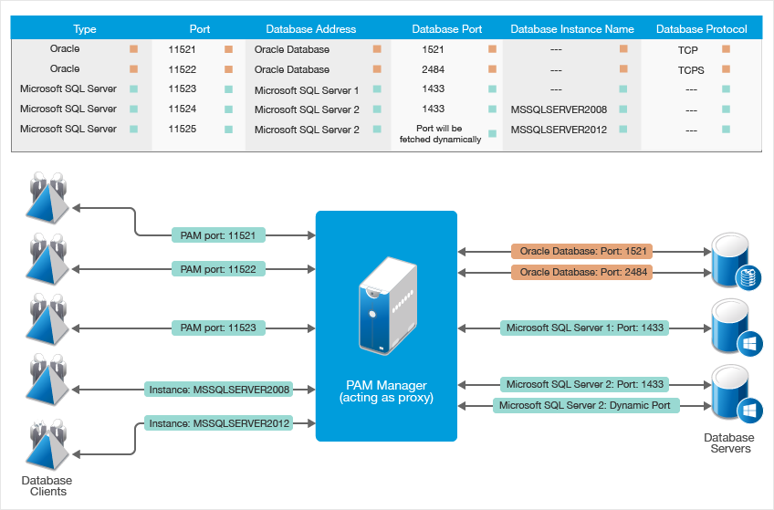
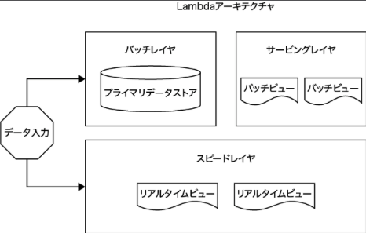
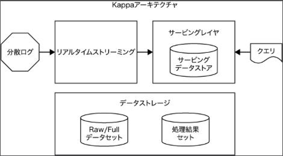
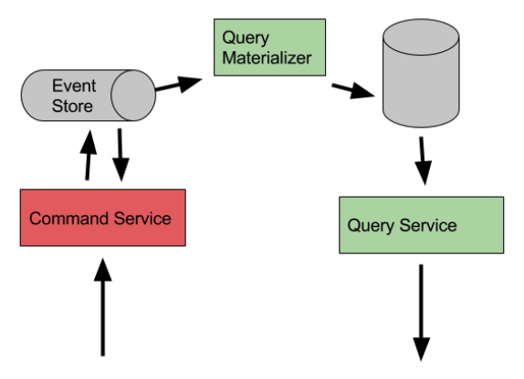
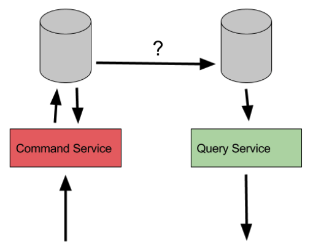

# DBRE 輪読会 Chap.12

〜さまざまなデータアーキテクチャ〜
2021/09/29

---
<!--
## 前回までのあらすじ

--- -->

## 今回学ぶこと

“本章では、こうした現実世界に則ったアーキテクチャのサンプルをいくつか紹介します。フィールドワークで見かけた野生のデータベース達をどのように活用してデータドリブンなアーキテクチャを構築し、そこで発生する諸々の問題に対してどのように解決していくのか、踏み込んでいきます。”

抜粋:: Laine Campbell  “データベースリライアビリティエンジニアリング”。 Apple Books

---

## この章の概要

1. アーキテクチャのコンポーネント
2.

---

## 12.1 アーキテクチャのコンポーネント

“これから紹介する諸々のコンポーネントを理解して使いこなすのは、DBREの日々の業務の1つです。サービスのエコシステムにおいてデータベースだけを見ていれば、ほかのコンポーネントは無視してよい、という時代はすでに終わりました。コンポーネント一つひとつがデータベースの可用性、データ統合性、そして一貫性それぞれに確かな影響をおよぼす現在では、サービスの設計および運用においてコンポーネントを無視してよい道理はありません。”

抜粋:: Laine Campbell  “データベースリライアビリティエンジニアリング”。 Apple Books

---

### 12.1.1 フロントエンドデータベース - 種類

- もっともよく使われている
- [OLTP: Online Transaction Processing](https://www.oracle.com/database/what-is-oltp/)
  - オンラインバンキング、ショッピング、注文入力、テキストメッセージの送信など、同時に発生する多数のトランザクションを実行することができる
- [OLAP: Online Analytical Processing](https://yellowfin.co.jp/blog/2020/02/17-jpblog1-what-is-olap)
  - DB上に蓄積された大量のデータに対して集計や複雑で分析的な問い合わせを行い、使用するユーザーにとって必要な結果を素早く抽出することができる
- OLTP と OLAP の違い
  - OLTPはトランザクションという小さいサイズのデータ処理を得意としており、大量に発生するアクセスに確実に対応し迅速に応える機能に特化しています。対して、OLAPは分析処理が得意で複数のデータを元に結果を出すような大量データの取り扱いに特化しています。

---

### 12.1.1 フロントエンドデータベース - 求められる仕様

- 低いレイテンシでの読み込みと書き込み
- 高い可用性
- 短い平均復旧時間（MTTR）
- 高いスケーラビリティ（アプリケーションのトラフィックに応じてスケールすること）
- アプリケーションと運用側サービスとの連携が容易であること

→ DB 単体でこれらを満たすことは容易ではない！

---

### 12.1.2 データベースアクセスレイヤ(DAL)

“アプリケーションがデータベースにアクセスし、読み込みや書き込みを行うための方法を提供します。その実態は、クエリやストアドプロシージャをメソッドとして利用可能な一連のオブジェクト群です。この抽象化によって、データベースの複雑性はソフトウェアエンジニアから隠蔽されることになります。”

抜粋:: Laine Campbell  “データベースリライアビリティエンジニアリング”。 Apple Books

- DAO（Data Access Object）
- ORM（Object Relational Mapper）

特定のメソッドを使用してパフォーマンスを達成しなければならない場合、それを意識した効果的なコードを書かなければなりません。データベースに知見があるエンジニアは、どのメソッドを使えば高いパフォーマンスが得られるのか把握しています。ただ、そうでないエンジニアにとっては、好む好まざるにかかわらず、スキーマに関して深い理解を求められることになるでしょう。

抜粋:: Laine Campbell  “データベースリライアビリティエンジニアリング”。 Apple Books

---

### 12.1.3 データベースのプロキシ

- アプリケーションサーバーとフロントエンドDBの間に位置する

参考：[Database Access Through PAM Proxy](https://www.netiq.com/documentation/privileged-account-manager-35/npam_admin/data/t46b6i636j6s.html)

---

### 12.1.3 データベースのプロキシ - レイヤごとの特徴

- レイヤ4プロキシはトランスポーテーション層の情報を利用して、リクエストをアプリケーションからデータベースに分散する
- レイヤ7プロキシは、TCPパケットに含まれるデータを参照することで、DBプロトコルやルーティングプロトコルにも対応できる
  * バックグラウンドのサーバーへヘルスチェックを実行し、リクエストをヘルシーなサーバーへリダイレクトする。
  * 読み込み要求はレプリカに書き込み要求はマスタに送るといった種別ごとに分散する。
  * コードでチューニングが不可能なクエリを最適化する。
  * クエリ結果をキャッシュする。
  * トラフィックをラグが少ないレプリカにリダイレクトする。
  * クエリのメトリクスを生成する。
  * クエリタイプやホストごとにファイアーウォールとしてのフィルタを実行する。

---

### 12.1.3 データベースのプロキシ - SLO観点ごとの特徴

- 可用性
  - 傘下のノードに障害が発生した場合にバランシングする
- データの統合性
  - 非同期のレプリケーションでラグが大きいレプリカを除外する
- スケーラビリティ
  - 読み込み要求を傘下のレプリカに効果的に分散させる
  - コネクションをキューのように扱い最大接続数に応じて分割する
- レイテンシ
  - レイヤ4プロキシの場合、トランザクション全体に与えるレイテンシは少ない
  - レイヤ7プロキシの場合、レイテンシが増大するため、DBだけでなくアプリケーションも含めた改善が必要となる
    - 向上的に実行されるクエリのキャッシュ、負荷が大きいサーバーへの振り分け停止、非効率なクエリの書き直しなど

---

### 12.1.4 イベントとメッセージシステム

- イベント（トランザクション）と連動して実行されるべきアクション
  * データベースと連携している分析システムやレポジトリとの同期を取るアクション
  * アクションごとの順番を保持するアクション
  * トランザクションの内容が詐欺にかかわるものでないかをチェックするアクション
  * キャッシュやCDNにデータをアップロードするアクション
  * 個人情報にかかわるデータを加工するアクション

---

### 12.1.4 イベントとメッセージシステム - 例

- システムの実装例
  - Apache Kafka, RabbitMQ, Amazon Kinesis, ActiveMQ など
- もっとも単純なユースケース
  - データストアに追加される新規データを継続的もしくは定期的にポーリングし、データの抽出（extract）、変形（transform）、ロード（load）といったETLジョブを行う

---

### 12.1.4 イベントとメッセージシステム - SLO観点ごとの特徴

- 可用性
  - リソースの最適化と同時並行性の負荷を減らすことで、コアサービスの可用性を向上させる
- データの統合性
  - システム間のデータの受け渡しにおいてデータの破損と消失は大きなリスク
    - データ消失を避けるためにはコンシューマがキューの中のデータのコピーを作成しなければならず、監査プロセスはそのコピーをオリジナルと比較する必要がある
  - ある程度データ損失が許容される場合にはサンプリングしたいくつかのデータをチェックするだけで済ませることも可能
- スケーラビリティ
  - 直行する２つの負荷を切り離すことでシステムを疎結合に保つことが可能
- レイテンシ
  - コンフリクトを減らしてレイテンシを減らすことが期待できる
  - 一方、わざわざキューに渡す追加のレイテンシが非同期で発生すること留意が必要

---

### 12.1.5 キャッシュトメモリストア

- ディスクではなくRAMにデータを格納することで読み込みを高速に
- 頻繁に更新されないデータ、揮発性を許容できるデータに有用
- キャッシュを追加する方法
  1. DB → キャッシュ の順でデータを書き込み
  2. DB, キャッシュ 同時にデータを書き込み
     - 一方でも書き込みに失敗するとキャッシュの意味を成さない
  3. キャッシュ → DB（毎回・同期） で書き込み（Write Through）
  4. キャッシュ → DB（一括・非同期） で書き込み（Write Back）
     - 他にも Write Allocation, Write Around などあり（[参考](https://www.geeksforgeeks.org/write-through-and-write-back-in-cache/)）

---

### 12.1.5 キャッシュトメモリストア - SLO観点ごとの特徴

- 可用性
  - メインのDBがダウンしていてもキャッシュを使えるので向上
  - 一方、キャッシュシステムに障害が発生したときのメインDBへの負荷はリスク
  - 同時多発リクエスト群（Thundering herd）による負荷問題も注意（キャッシュ有効期限切れなどにより発生）
- データの統合性
  - キャッシュの永遠の課題。キャッシュの更新チェック頻度とレスポンスの正確性はトレードオフ
  - データの更新頻度が低い場合はそこまで考慮しなくていい
  - データの性質やアプリの要件に応じてキャッシュの書き込み方式や更新頻度を考慮する
- スケーラビリティ
  - 向上するが、キャッシュサーバーに障害があった場合でも乗り切れるような設計が必要
- レイテンシ
  - 同上。アーキテクチャに複雑性が増すことを考慮したうえで意思決定を

---

## 12.2 データアーキテクチャ

---

### 12.2.1 LambdaとKappa - Lambdaアーキテクチャ

- 大量のデータをほぼリアルタイムで捌く一方、長時間処理にも対応
- ２つの異なるコードベースを保守する必要あり

---

### 12.2.2 LambdaとKappa - KappaLambdaアーキテクチャ

- Lambdaの複雑性を解消し、データ移行やシステム再構成が容易に

---

### 12.2.2 イベントソーシング（[参考](https://blog.framinal.life/entry/2019/08/12/213359)）

- 状態(ステート)ではなくイベントを中心としてデータを扱う
  - データストアにデータの「現在の状態」だけを格納するのではなく、そのデータに対して実行された一連のすべての実行を記録しておく

---

### 12.2.2 イベントソーシング - メリデメ

- メリット
  - 完全な履歴が残る
  - いつでも過去に戻れる
  - CQRSとの親和性が高い
- デメリット
  - イベントを保存するログが膨大
  - 最終結果を得るために毎回リプレイの必要あり
  - バージョンアップしたら過去のイベントと整合性をどうとるか
  - イベントが一部欠損したらもどせない

---

### 12.2.3 CQRS（[参考](https://postd.cc/using-cqrs-with-event-sourcing/)）

- CRUDと違ってCQRSは、データの読み込みと書き込みは違うものだという前提にもとづく考えかた
- CQRSでは、データベースの操作をコマンド（データを書き換える操作）とクエリ（データを読み込む操作）の二つに分類します。コマンドは一般に、操作の成否以上の情報を呼び出し側に返しません。また、クエリは冪等であることが保証されます。間にコマンドが挟まらないという前提で、同じクエリを何度実行しても結果は同じになるということです。RESTでいうと、コマンドはPUTやPOSTに対応し、クエリはGETに対応するものです。

---

